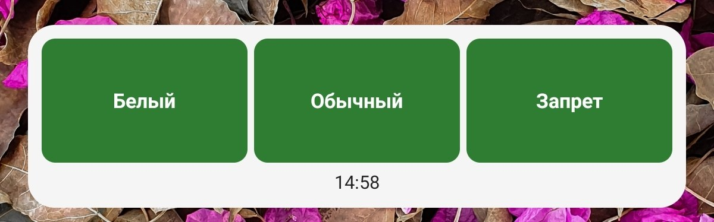
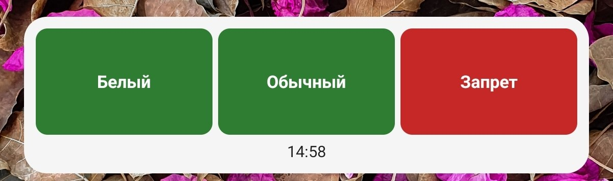
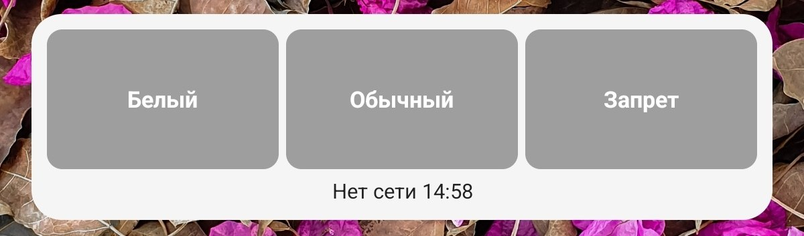

# Доступ

Виджет на рабочий стол: видно, открываются ли в текущей сети сайты из белого списка, обычные сайты и обычно заблокированные.

Значок приложения открывает списки сайтов для трёх групп. По умолчанию списки встроены в приложение; их можно изменить и сбросить к встроенным. Проверять нужно сам виджет: нажатие на виджет запускает проверку и не открывает приложение.

Зелёный — группа открывается, красный — нет, серый — нет сети.

## Скачать

Нужен телефон на **Android 8.0** или новее.

[Скачать APK](https://github.com/blinlol/dostup-app/releases/latest/download/Dostup.apk)

## Установка

1. Разрешите установку из неизвестных источников для браузера или файлового менеджера.
2. Откройте скачанный `Dostup.apk` и установите.
3. Если раньше стояла отладочная сборка из Android Studio — сначала удалите её, затем поставьте этот APK. Иначе система не даст обновить приложение: другой ключ подписи.

Следующие версии с GitHub ставятся поверх этой, без удаления.

## Как добавить виджет

1. Долгое нажатие на свободное место рабочего стола.
2. Выберите «Виджеты».
3. Найдите **Статус доступа** и перетащите на стол.
4. Нажмите на виджет, чтобы запустить проверку.

Приложение никуда не отправляет ваш аккаунт: проверка — это обычные HTTPS-запросы к сайтам из списков (по умолчанию они встроены в приложение, их можно править и сбрасывать в значке приложения). Лицензия — [MIT](LICENSE).
